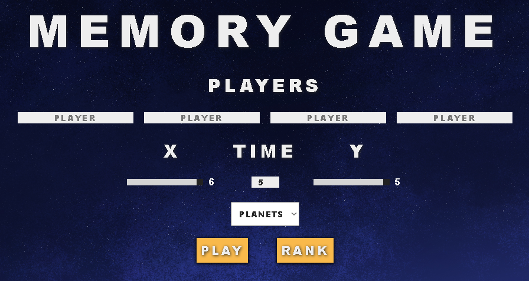
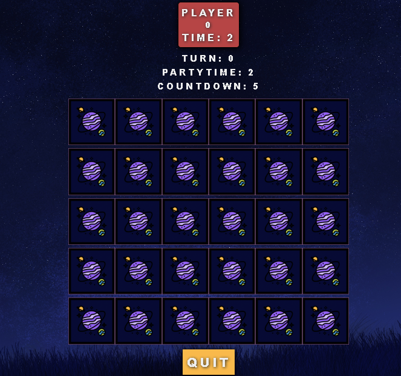
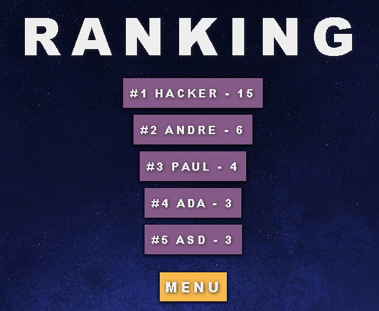

# Memograma
> André Martínez Moreno

### Features
- Memory Game
- MultiPlayer
- Competitive

### Languages
- HTML
- CSS
- JavaScript
- PHP

### Requisites
- PHP Server or Web Server

### How to Play
- Open the Form.html in your web browser (with your Web server or PhP server).
- Configure the party with the html Form and click Play.
- Play a Memory Game alone or with friends.
- See the ranking and see who is the best Memory Player!

### Game

